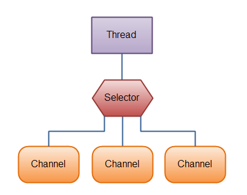

# 핸즈온 머신러닝(3판)

<figure><figcaption></figcaption></figure>

머신러닝은 관심이 많은 영역으로 개발자로 살아가면서 조금씩 학습하고 있다..

도서의 분량은 두권으로 분리 될 정도로 많지만 머신러닝을 학습하고자 하는 님들에게 필요한 것들로 두권을 한달 가까이 정독을 하였다,  모든 예제를 실습하면서 읽었으면 하는 아쉬움이 남는다. 학습 하는 님들의 편의를 위해서 두권으로 나눈 것이 지하철에서 이동 하면서 읽기에 좋았다.

데이터 과학을 공부하지 않는 친구들에게 어려운 책이지만 기초 설명, 수학 이론, 실습, 예제를 통해서 접근 하고 있어서 수학 이론에 약한 나에게 수학 이론을 찾아 볼 수 있게 하여.좋았다.

&#x20;1부에서는 머신러닝의 개념을 소개 하는 파트로 기본적인 머신러닝의 개념, 학습방법( 분류 / 모델훈련 / 서포트 벡터 머신 / 결정 트리 / 앙상블학습과 랜덤 포레스트 / 차원 축소 / 비지도 학습)에 대해서학습을소할 수 있고 2부에서는 신경망과 딥러닝의 학습 할 수 있다 특히 12장의 텐서플로의 구조 및 사용법, 타입변환/변수/다른 데이터구조, 사용자 정의, 주로 사용하는 함수에 대해서 설명하고 13장의 대용량 데이터셋에대한 멀티스레드와 큐를 사용하여, 여러 파일에서 동시에 읽고, 샘플을 셔플링하거나 배치로 만드는 등의 작업을 수행하는 것을 학습 할 수 있어서 좋았다.

&#x20;파이션, 데이터 과학을 학습 한 친구들이 머신러닝을 학습 할 수 있는 교과서로 님들에게 추천 합니다.

한빛미디어 <나는 리뷰어다> 활동을 위해서 책을 제공받아 작성된 서평입니다
