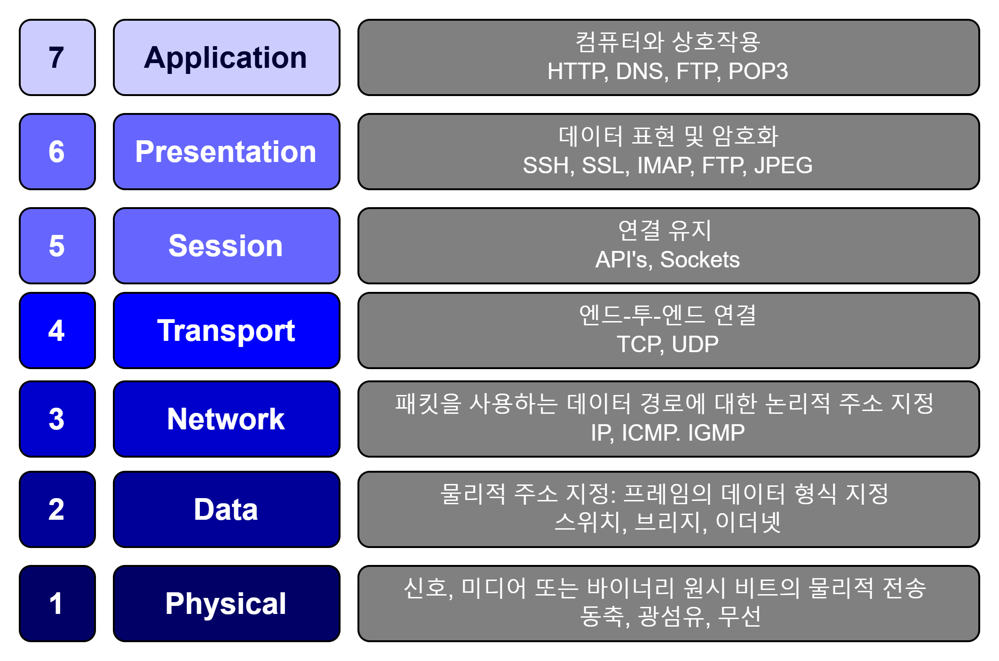

# TCP/IP

TCP/IP를 알아보기 전에 간략하게  OSI 7계층에 대해서 먼저 알아보고자 합니다.

## 1. OSI 7계층

**OSI 7계층**은 **Open Systems Interconnection** 참조 모델로, 네트워크 통신에서 일어나는 과정을 7개의 계층으로 나누어 표준화한 모델입니다.

<figure><figcaption>
OSI 7 계
</figcaption></figure>

1. **물리 계층 (Physical Layer)**: 사용자 데이터를 물리 매체상에서 소통이 가능한 통신 신호로 변환하여 전송하는 역할을 담당합니다. 전기적, 기능적, 절차적, 물리적 특성을 정의하며, 데이터를 규정된 신호로 변환하고 이를 케이블을 통해 전달합니다.
2. **데이터링크 계층 (Data Link Layer)**: 직접 연결된 서로 다른 2개의 네트워킹 장치 간의 데이터 전송을 담당합니다. 데이터링크 계층에서 전송되는 데이터를 일반적으로 '프레임’이라고 합니다. 프레임의 종류, 길이 등을 정의하며, MAC (Media Access Control)을 사용하여 프레임을 전송합니다
3. **네트워크 계층 (Network Layer)**: 라우팅과 패킷 전달을 담당합니다. 데이터를 최적 경로로 전송하고, IP 주소를 사용하여 목적지를 식별합니다.
4. **전송 계층 (Transport Layer)**: 호스트 간의 데이터 전송을 담당합니다. TCP와 UDP를 포함하며, 신뢰성 있는 연결형 서비스와 빠른 비연결형 서비스를 제공합니다.
5. **세션 계층 (Session Layer)**: 데이터 교환을 관리하고 동기화를 유지합니다. 세션 설정, 유지, 종료를 담당합니다.
6. **표현 계층 (Presentation Layer)**: 데이터 형식 변환, 암호화, 압축 등을 수행합니다. 응용 계층과 하드웨어 간의 인터페이스 역할을 합니다.
7. **응용 계층 (Application Layer)**: 사용자가 네트워크에 접근할 수 있도록 합니다. 이메일, 파일 전송, 원격 데이터베이스 관리 등의 서비스를 제공합니다.

## 2. TCP/IP

**TCP/IP**는 **인터넷 프로토콜 스위트** (Internet Protocol Suite)로 알려져 있으며, 인터넷과 이와 유사한 컴퓨터 네트워크 사이에서 정보를 주고받는 이용되는 통신 프로토콜의 모음으로 프로토콜 스위트는 현재 기본 프로토콜로 전송 제어 프로토콜 (Transmission Control Protocol: TCP)과 인터넷 프로토콜 (Internet Protocol: IP)을 포함하고 있습니다.

* **TCP (전송 제어 프로토콜)**: 두 기기 간에 데이터를 전송하는 역할을 담당합니다. 데이터를 작은 패킷으로 나누어 효율적으로 전송하며, 연결형 서비스를 제공합니다.
* **IP (인터넷 프로토콜)**: 데이터의 조각을 최대한 빨리 대상 IP 주소로 보내는 역할을 합니다. 데이터 전송의 과정에서 TCP와 함께 작동하여 인터넷 데이터 교환을 지원합니다.

<figure><figcaption>
OSI 계층 참조 모델과 TCP/IP 프로토콜 4계층 참조 모
</figcaption></figure>

* **카프카**는 **네트워크 계층**에서 **IP 프로토콜**을 사용합니다. 이를 통해 데이터를 안전하게 전달하고, 메시지 브로커로서의 역할을 수행합니다
* &#x20;**RabbitMQ**는 **데이터 링크 계층**에서 **AMQP 프로토콜**을 사용합니다. 이를 통해 메시지 큐와 메시지 브로커로서의 역할을 수행합니다

### 2-1. TCP/IP 네트워크 동작 원리

<figure><figcaption></figcaption></figure>

### 2-2. 패킷 해더 구조

#### 2-2-1. TCP Header

<figure><figcaption></figcaption></figure>

* **출발지 포트 (Source Port)**: 송신 측의 포트 번호입니다.
* **도착지 포트 (Destination Port)**: 수신 측의 포트 번호입니다.
* **시퀀스 번호 (Sequence Number)**: 데이터 순서를 나타내는 값입니다.
  * SYN Flag = 1: 초기 순서 번호
  * SYN Flag = 0: 세스먼트의 순서번호
* **응답 번호 (Acknowledgment Number)**: 수신자가 기대하는 다음 바이트의 순서 번호입니다.
* **플래그 (Flags)**: 여러 상태를 나타내는 비트입니다. 예를 들어, **SYN**, **ACK**, **PSH**, **FIN** 등이 있습니다.
  * ACK: 확인 응답 번호&#x20;
  * SYN: 연결 초기화하기 위해 시퀀스 번호 동기화
  * PSH: TCP가 즉시 메세지를 상위계층 프로세스에 즉시 전달할 수 있도록 하는 것. 즉 데이터를 가능한 빨리 응용계층으로 보내야 할 떄 사용합니다.
  * PST: 연결 재설정 요청&#x20;
  * FIN: 송신측이 데이터 전송을 종료&#x20;
* **윈도우 크기 (Window Size)**: 수신 측이 받을 수 있는 데이터 사이즈를 수신측에서 송신측으로 전송하는 값입니다.
* **체크섬 (Checksum)**: TCP 헤더와 세그먼트 전체에 대한 오류 검사 값입니다.
* **긴급 포인터 (Urgent Pointer)**: 긴급하게 처리해야 할 데이터의 마지막 바이트 위치를 나타냅니다.
* **옵션 (Options)**: 연결이 설정되는 동안 협상할 최대 세그먼트 크기 (MSS) 등을 정의합니다.

#### 2-2-2. IP Header

<figure><figcaption></figcaption></figure>

* **버전 (Version)**: IPv4인지 IPv6인지를 나타냅니다.
* **헤더 길이 (Header Length)**: IP 헤더의 크기를 나타냅니다. 해더가 가변적이고 IP Option에 따라 길이가 달라집니다.
* **TOS (Type of Service)**: 서비스 유형(취소지연, 최대처리율, 최대신뢰성, 최소비용)을 표시하며, 패킷 처리 우선 순위 정보를 담고 있습니다.
* **전체 길이 (Total Length)**: IP 헤더를 포함한 패킷 전체의 길이를 나타냅니다. ( Payload까지 포함한 패킷의 길이)
* **ID, Flag, Fragment Offset**: 패킷 분열 정보를 담고 있습니다.
  * ID: 패킷의 단편화 여부
  * Flag: 분열되기 전의 총 길이(138 bit)
* **TTL (Time to Live)**: 패킷이 네트워크 상에서 살아 있을 수 있는 시간을 제한합니다.
* **프로토콜 (Protocol)**: 상위 프로토콜을 나타냅니다.
* **헤더 체크섬 (Header Checksum)**: IP 헤더의 오류 검사 값입니다

