# 자바 동기/비동기

일반적으로 데이터를 주고 받는 방식은 다음과 같은 방식이 있습니다.

* **동기식  :**  작업 요청이 들어오면 현재 작업을 중지하고 새로운 요청애 대해서 바로 응답을 주는 것으로  전화가 오면 전화 통화를 바로 하는 것입니다.&#x20;
* **비동기 :**  작업 요청이 들어오면 다른 곳으로 넘기고 핸재 작업을 진행 것으로 다른 곳에서 처리된 결과를 미래에 어는 시간에 전달하는 것으로 메일을 받으면 바로 답장응 하지않고 미래 어느날 답장을 보내는 것입니다.&#x20;
* **병렬 :** 작업 요청이 들어오면 현재 작업을 진행 하면서 동시에 요청에 대한 처리는 하영 응답을 주는 것 입니다. &#x20;

프로그램에서  작업은 하나의 스레드에서 진행을 하는데 비동기 프로그램은 현재 진행하는 스레드와 별개로 처리 하기 위해 Queue 대기열에 넣어 두고 작업을 하기 때문에 항상 다른 스레드를 사용하지은 않습니다. 스레드 작업은 리소스이 소요 비용이 많이 들어가는 작업으로 스레드가 많을수록 비용이 많이 발생 하므로 이점을 주의 해야 합니다.

**비동기 시퀀스 다이어그래 예시**

<table data-header-hidden><thead><tr><th width="402"></th><th></th></tr></thead><tbody><tr><td>

</td><td><ol><li>작업1은 실행 후 바로 응답을 받는 동기작업입니다.</li><li>
작업2는 JOB_01를 실행하고 응답을 받기전에 작업 3이  JOB_02를 실행합니다. 
<ol><li>작업2 : JOB_01 실행  요청 </li><li>작업3 : JOB_02 실행  요청 </li><li>작업 3에 대한 응답 받음</li><li>작업 2에 대한 응답 받음</li></ol></li></ol></td></tr></tbody></table>

시퀀스 다이어그램에서 확인했듯이 비동기 프로그램에서는 요청에 대한 응답이 작업2 처럼 바로 응답이 들어 오지않고 작업3을 바로 실행합니다. 또한 작업2, 작업3에 대한 응답도 작업2가 먼저 응답해 준다는 보장을 못합니다. 프로그램을 작성 할 때는 이점을 주의해서 작성해야 합니다.&#x20;

<mark style="color:orange;">**비동기 프로그램의 장단점은 다음과 같습니다**</mark>**.**

* **장점**
  * 하나의 작업이 완료될 때까지 기다리지 않고 다른 작업을 수행할 수 있습니다.
  * 시간이 오래 걸리는 작업을 수행할 떄 동기적으로 처리하는 것보다 빠르게 처리 합니다. ( 만약 화면에서 호출이 되었다면 다른 화면에서의 작업을 진행할 수 있습니다. 몰론 결과애 대해서는 나중에 받아볼 수 있습니다.)
  * 다수의 요청을 처리하는 작업에서는 비동기 프로그램으로 처리하면 더 많은 요청을 처리할 수 있습니다.
* **단점**
  * 비동기 프로그램은 코드가 복잡해 지고 콜백 지옥과 같은 문제가 있습니다.
  * 동기 프로그램 보다 디버깅이 어렵습니다.

자바에서 비동기 프로그램을 사용하기 위한 방법은 다음과 같습니다.

* NIO(Non-blocking IO) 패키지 사용
* CompletionHandler ( 콜백 )
* 함수형 인터페이스
* Completable Future&#x20;
