# 자바비동기

비동기 프로그램은 하나의 작업이 완료될 때까지 기다리지 않고 다른 작업이 별도의 스레드로 분리하여 동시에 수행하는 방식으로 자바에서는 java.nio 패키지를 통해 비동기 io를 지원하고 있습니다.

<table data-header-hidden><thead><tr><th width="402"></th><th></th></tr></thead><tbody><tr><td>

</td><td><ol><li>작업1은 실행 후 바로 응답을 받는 동기작업입니다.</li><li>작업2는 JOB_01를 실행하고 응답을 받기전에 작업 3이  JOB_02를 실행합 </li></ol></td></tr><tr><td></td><td></td></tr><tr><td></td><td></td></tr></tbody></table>

ㅇㅁㄴㄴ

1. ㅇㄴㅁㅇㅁ

비동기 프로그램의 장단점은 다음과 같습니다.

* 장점
  * 하나의 작업이 완료될 때까지 기다리지 않
* 단점

자바 5부터 Future 인터페아
