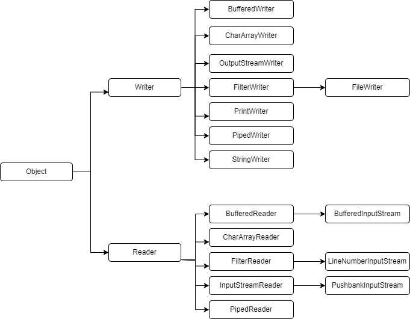

# IO(Blocking IO)

Java IO 패키지는Java에서 입출력을 다루기 위한 패키지로 하나의 Thread가 IO 작업에 의존적이기 때문에 하나의 Thread로 하나의 IO를 처리하는 **Blocking 방식  구현**으로 InputStream, OutputStream, Reader, Writer 클래스를 사용합니다.&#x20;

* **바이트 단위** : IputStream, OutputStream\
  \- 이미지, 비디오 및 직렬화 된 객체와 같은 이진 데이터\
  \- InputStream.read() : 바이트 스트림의 원시 내용에 해당하는 0에서 255 사이의 바이트 값을 반환
* **문자 단위** : Reader,  Writer \
  \-  문자 스트림이므로 문자 데이터 \
  \- Reader.read() : 0에서 65357 사이의 문자 값을 반환&#x20;

&#x20;<mark style="color:red;">Java NIO와 달리 기존 IO 패키지는 JVM 내부 버퍼로 복사 시 발생하는 CPU 연산, GC 관리, IO 요청에 대한 스레드 블록이 발생하게 되는 현상 때문에 효율이 좋지 못한 점이 있습니다</mark>

## 1. Java IO 패키지의 핵심 용어

* **InputStream**: 바이트 단위로 입력을 처리하는 클래스입니다.
* **OutputStream**: 바이트 단위로 출력을 처리하는 클래스입니다.

<figure><figcaption><p>자바 IO 팩키지</p></figcaption></figure>

* **Reader**: 문자 단위로 입력을 처리하는 클래스입니다.
* **Writer**: 문자 단위로 출력을 처리하는 클래스입니다.

<figure><figcaption></figcaption></figure>

## 2. 파일 읽기

파일을 읽기 위해서는 다음 순서로 코드를 작성해야 합니다.

1. **파일 객체 생성**: \
   \- `File file = new File("filename.txt");`
2. **파일 입력 스트림 생성**: \
   \- `FileInputStream inputStream = new FileInputStream(file);`
3. **버퍼 생성**: \
   \- `byte[] buffer = new byte[1024];`
4. **입력 스트림으로부터 데이터를 버퍼에 읽어옴**: \
   \- `inputStream.read(buffer);`
5. **버퍼에서 읽어온 데이터를 문자열로 변환**: \
   \- `String data = new String(buffer);`
6. **입력 스트림 닫기**: \
   \-`inputStream.close();`

### 2-1. Byte 단위로 읽기

InputStream은 Byte 단위로 읽어 들이는 것으로 InputStream  확장해서 만든  FileInputStream 클래스를 사용하여 파일에서 데이터를 읽게 합니다.


```java
FileInputStream fileInputStream = null;
try {
  fileInputStream =  new FileInputStream(fileName) ;
  int readChar = 0;
  while ((readChar = fileInputStream.read()) != -1) {
    System.out.println((char)readChar);
  }
} catch (IOException e) {
  System.out.println("파일을 확인해 주세요");
  throw new RuntimeException(e);
} finally {
  if (fileInputStream != null  ) {
    try {
      fileInputStream.close();
    } catch (IOException e) {
      throw new RuntimeException(e);
    }
  }
}
```


* 3 line : 파일 객체 생성 합니다.
  * FileInputStream 생성자의 인수로 파일을 넘겨주면 내부에서 File를 객체를 생성합니다.&#x20;
  *   파일 읽기의 1, 2번 사항 입니다.

      ```java
      public FileInputStream(String name) 
                      throws FileNotFoundException {
          this(name != null ? new File(name) : null);
      }
      ```
* 4 line : read() 메서드는 Data를 한 Byte씩 읽어서 값이 없으면 -1로 돌려 주는 메서드로 파일을 읽어 마지막 인지 체크하기 위해 선언한 변수로 초기값 0으로 설정합니다.
* 5 line : Data를 한 Byte씩 읽어서 없으면 while문을 벗어납니다.
* 6 line : 읽은 문자는 Char로 변환 해서 출력합니다.

<figure><figcaption></figcaption></figure>

* 8 - 11 line : File에 관한 예외 처리 로직
* 12 - 17 line : File을 열어서 작업을 했으므로 열려 있는 파일을 닫아야 합니다.

#### 2-1-1. 예제 1의 문제점

한글 파일인 경우 <mark style="color:red;">**한글이 깨지는 문제**</mark> 입니다. 해당 문제를 해결하기 위해서는 문자셋을 지정해야 하므로 InputStreamReader 클래스를 사용하여 FileInputStream객체에서 읽어들인 데이터를 문자열로 변환합니다.


```java
 InputStreamReader inputStreamReader = null;
  try {
    inputStreamReader = new InputStreamReader(
             new FileInputStream(fileName),
            "UTF-8");
    int readChar = 0;
    while ((readChar = inputStreamReader.read()) != -1) {
      System.out.println((char)readChar);
    }
  } catch ....
```


*   3 line :  InputStreamReader 메서드의 두번째 파라메터에 문자셋을 지정 하여 읽어야 합니다.

    ```
     public InputStreamReader(InputStream in, String charsetName)
                    throws UnsupportedEncodingException {
    ```

    * 파일의 문자셋에 맞는 문자셋를 지정 합니다. ( "UTF-8", "EUC-KR" )

<details>

<summary>Byte 단위로 읽기 (문자셋전설정)  - 전체 소스</summary>


```java
public static void CharReadFile(String fileName, 
                                String charsetName) {
    InputStreamReader inputStreamReader = null;
    try {
      inputStreamReader = new InputStreamReader(
               new FileInputStream(fileName),
              charsetName);
      int readChar = 0;
      while ((readChar = inputStreamReader.read()) != -1) {
        System.out.println((char)readChar);
      }
    } catch (UnsupportedEncodingException e) {
      System.out.println("엔코딩에 문제가 있습니다.");
      throw new RuntimeException(e);
    } catch (IOException e) {
      System.out.println("파일을 확인해 주세요");
      throw new RuntimeException(e);
    } finally {
      if (inputStreamReader != null  ) {
        try {
          inputStreamReader.close();
        } catch (IOException e) {
          throw new RuntimeException(e);
        }
      }
    }
  }
}
```


</details>

### 2-2. Line 단위로 읽기

line 단위로 읽기 위해서는 reader 객체나 자바 8 이상에서는 Files 클래스를 이용하는 방법이 있습니다.

#### 2-2-1.  InputStream /  Reader 클래스 사용&#x20;

Reader 클래스를 상속 받은 BufferedReader를  Byte로 읽어 들이는 InputStream 클래스와 같이 사용해서 Line 단위로 읽게할 수  있습니다.


```java
BufferedReader  bufferedReader  = null;
try {
   bufferedReader = new BufferedReader(
      new InputStreamReader(
              new FileInputStream(fileName),
              charsetName));
   String readLine;
   while ((readLine = bufferedReader.readLine()) != null) {
       System.out.println(readLine);
   } 
} catch ( .....
```


* 3 - 6 line : Byte 단위로 읽어 들이는 FileInputStream 클래스에 InputStreamReader 클래스를  이용하여 문자셋으로 적용하고 읽어 들인 것을 BufferReader를 사용하여 Line단위로 읽을수 있게 합니다.
* 7 - 9 line : bufferedReader.readLine()은 읽을 데이터가 없으면 null로 반환하고 있으면 라인의 데이터를 돌려 주는 메서드여서 readLine 변수를 사용하고 데이터가 없으면 while문을 탈출 합니다.

<details>

<summary>Line 단위로 읽기 - 전체 소스</summary>


```java
public static void LineReadFile(String fileName, String charsetName) {
    BufferedReader  bufferedReader  = null;
    try {
      bufferedReader = new BufferedReader(
              new InputStreamReader(
                      new FileInputStream(fileName),
                      charsetName));
      String readLine;
      while ((readLine = bufferedReader.readLine()) != null) {
        System.out.println(readLine);
      }
    } catch (UnsupportedEncodingException e) {
      System.out.println("엔코딩에 문제가 있습니다.");
      throw new RuntimeException(e);
    } catch (IOException e) {
      System.out.println("파일을 확인해 주세요");
      throw new RuntimeException(e);
    } finally {
      if (bufferedReader != null  ) {
        try {
          bufferedReader.close();
        } catch (IOException e) {
          throw new RuntimeException(e);
        }
      }
    }
  }
```


</details>

### 2-3. Line 단위로 읽기 문자셋 변경

#### 2-2-1.  InputStream /  Reader 클래스 사용&#x20;

2-2. Line 단위로 읽기 코드에서 라인 단위로 읽은 데이터를 getBytes() 메서드를 사용해서 문자셋 변경을 하고 문자열로 바꾸면 됩니다.


```java
while ((readLine = bufferedReader.readLine()) != null) {
  byte[] utf8Bytes = readLine.getBytes("UTF-8");
  String utf8String = new String(utf8Bytes, "UTF-8");
  System.out.println(utf8String);
}
```


* 2 line : getBytes를 사용해서 문자셋 변환("UTF-8", "EUC-KR") 합니다.
* 3 line : System.out으로 출력하기 위해 문자열로 변환합니다.

<details>

<summary>Line 단위로 읽기 문자셋 변경 - 전체 소스</summary>


```java
public static void ConvertLineReadFile(String fileName, 
                      String fromCharset , 
                      String toCharset) {
    BufferedReader  bufferedReader  = null;
    try {
      bufferedReader = new BufferedReader(
              new InputStreamReader(
                      new FileInputStream(fileName),
                      fromCharset));
      String readLine;
      while ((readLine = bufferedReader.readLine()) != null) {
        byte[] utf8Bytes = readLine.getBytes(toCharset);
        String utf8String = new String(utf8Bytes, toCharset);
        System.out.println(utf8String);
      }
    } catch (UnsupportedEncodingException e) {
      System.out.println("엔코딩에 문제가 있습니다.");
      throw new RuntimeException(e);
    } catch (IOException e) {
      System.out.println("파일을 확인해 주세요");
      throw new RuntimeException(e);
    } finally {
      if (bufferedReader != null  ) {
        try {
          bufferedReader.close();
        } catch (IOException e) {
          throw new RuntimeException(e);
        }
      }
    }
}
```


</details>

#### 2-2-2.  FileReader / BufferedReader 클래스 사용

InputStream 클래스를 FileReader 클래스로 변경을 하면 됩니다. FileReader 샹성자로 두번째 파라메터가 Charset 타입을 전달 해야하며 내부적으로는 FileInputStream를 사용합니다.  다음은 FileReader 클래스생성자 입니다.

```java
public FileReader(String fileName, Charset charset) throws IOException {
    super(new FileInputStream(fileName), charset);
}

// super 로 Charset 을 전달 하기 위해서는 Charset.forName(fromCharset)을 사용해야 한다.
public InputStreamReader(InputStream in, Charset cs) {
    super(in);
    if (cs == null)
        throw new NullPointerException("charset");
    sd = StreamDecoder.forInputStreamReader(in, this, cs);
}
```

* FileReader / BufferedReader 클래스 사용 소스


```java
BufferedReader  bufferedReader  = null;
try {
  bufferedReader = new BufferedReader(
          new FileReader(fileName, Charset.forName("UTF-8")) );
  String readLine;
  while ((readLine = bufferedReader.readLine()) != null) {
    byte[] utf8Bytes = readLine.getBytes(toCharset);
    String utf8String = new String(utf8Bytes, toCharset);
    System.out.println(utf8String);
  }
} catch ( ..... 
```


* 3 - 4 line : InputStream  클래스 대신 FileReader 클래스로 변경하고 Charset.forName() 메서드를 사용하여 Charset 타입으로 변경합니다.
* 나머지는 2-2-1과 동일 합니다.

<details>

<summary>Line 단위로 읽기 문자셋 변경 (FileReader / BufferedReader 클래스 사용) - 전체 소스</summary>


```java
public static void ConvertLineReaderFile(String fileName, 
                String fromCharset , 
                String toCharset) {
    BufferedReader  bufferedReader  = null;
    try {
      bufferedReader = new BufferedReader(
              new FileReader(fileName, Charset.forName(fromCharset)) );
      String readLine;
      while ((readLine = bufferedReader.readLine()) != null) {
        byte[] utf8Bytes = readLine.getBytes(toCharset);
        String utf8String = new String(utf8Bytes, toCharset);
        System.out.println(utf8String);
      }
    } catch (UnsupportedEncodingException e) {
      System.out.println("엔코딩에 문제가 있습니다.");
      throw new RuntimeException(e);
    } catch (IOException e) {
      System.out.println("파일을 확인해 주세요");
      throw new RuntimeException(e);
    } finally {
      if (bufferedReader != null  ) {
        try {
          bufferedReader.close();
        } catch (IOException e) {
          throw new RuntimeException(e);
        }
      }
    }
  }
```


</details>
