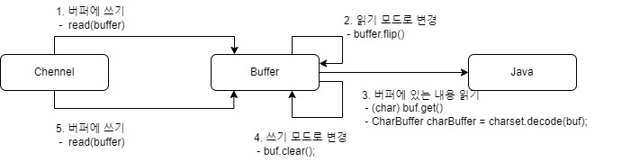

# 기본개념

## 1. 채널

* 채널을 읽고 쓸 수 있습니다. 스트림은 일반적으로 단방향(읽기 또는 쓰기)입니다.
* 채널은 비동기적으로 읽고 쓸 수 있습니다.
* 채널은 항상 버퍼를 읽거나 씁니다.

<figure><figcaption></figcaption></figure>

### 1-1. Channel 읽기

* FileChannel : 파일에서 데이터를 읽습니다.
* DatagramChannel : UDP를 통해 네트워크를 통해 데이터를 읽고 쓸 수 있습니다
* SocketChannel : TCP를 통해 네트워크를 통해 데이터를 읽고 쓸 수 있습니다
* ServerSocketChannel : 소겟 서버를 만들어 TCP를 수신 할 수 있습니다.

**소스에서 아래 부분이 채널에 관계된 부분입니다.**

```java
RandomAccessFile aFile = new RandomAccessFile(fileName, rwMode);
FileChannel inChannel = aFile.getChannel();
```

## 2.  Buffer

데이터는 채널을 버퍼로, 버퍼에서 채널로 쓰는데  데이터를 쓸 수 있는 메모리 블록이 Buffer 입니다. Buffer는 4단계 프로세스를   통해  데이터를 읽고 씁니다.

<figure><figcaption><p>버퍼 쓰기/읽기</p></figcaption></figure>

1. 버퍼에 데이터 쓰기
2. buffer.flip()
   * 데이터를 읽기 위해서는 buffer을 쓰기 모드에서 읽기 모드 변경해야 하는데 이것을 수헹하는 메소드 입니다.
3. 버퍼에서 데이터 읽기
4. buffer.clear() 또는 buffer.compact()
   * 모든 데이터를 읽은 후에는 버퍼를 지워야 합니다.
   * buffer.clear() : 모든 데이터를 읽은 후에는 버퍼를 지워야 합니다
   * buffer.compact() : 이미 읽은 데이터 만 지웁니다.
   * 읽지 않은 데이터는 시작 부분으로 이동하고. 데이터는 이제 읽지 않은 데이터 다음에 버퍼에 기록됩니다.

**소스에서 아래 부분이 buffer에 관계된 부분입니다.**

```java
// byte 단위로 메모리 할당
ByteBuffer buf =  ByteBuffer.allocate(allocate) ;

// 할당된 크기 만큼 버퍼에 읽어 드
int bytesRead = inChannel.read(buf)
// 버퍼를 읽기 준비 상태로 변경
buf.flip();

// 버퍼에 있는 내용 읽기 
(char) buf.get()
CharBuffer charBuffer = charset.decode(buf);

// 버퍼에 다시 쓰기 위해서 쓰기 모드로 변경 
buf.clear();
```

### 2-1. 버퍼 용량, 위치 및 한계

버퍼는 데이터를 쓸 수 있는 매모리 블럭으로 NIO Buffer 객체와 래핑되어 있어 메모리 블럭을 쉽게 작업할 수 있도록 하는 메서드로 다음과 같은 속성이 있습니다.

* capacity : 한번에 쓰기 위한 메모리의 크기로 bytes, longs, chars 등만 사용할 수 있어고 데이터를  쓰기전에 비워야 합니다.
* position : 메모리 블럭에 읽고 쓰는 위치를 의미하며 처음 위치는 0입니다. 쓰기 모드에서 읽기모드로 변경이 되면 0으로 재 설정 됩니다.
* limit : 읽고 쑈기 위한 최대 값 입니다.&#x20;

### 2-2.  Buffer Types

* ByteBuffer
* MappedByteBuffer
* CharBuffer
* DoubleBuffer
* FloatBuffer
* IntBuffer
* LongBuffer
* ShortBuffer

### 2-3.  버퍼 할당&#x20;

개체를 가져오려면 먼저 개체를 할당해야 합니다.   48 Byte를 할당하며면 다음과 같이 작성하면 됩니다.

```java
 ByteBuffer buf =  ByteBuffer.allocate(48) ;
 
 // 1024 문자를 할당 
 CharBuffer buf = CharBuffer.allocate(1024)
```

### 2-4. 버퍼에 쓰기

Channel에서 buffer로 쓰기 위해서는 다음과 같은 방법아 있습니다.

*   생성 후 채널에 있는 데이터를 읽으면 버퍼에 쓰게 됩니다.  &#x20;

    ```java
     int bytesRead = inChannel.read(buf);
    ```
*   직접 버퍼에 쓰기

    ```java
    buf.put(127);  
    ```

### 2-5. 모드 전환 ( flip() )

일기/쓰기 모드 전환은 통해서 데이터를 버퍼에 쓴 후 읽기를 하기 위해서는 읽기 모드로 변경 해야 하고 읽은 후에 다시 쓰기를 위해서는 쓰기 모드로 변경을 헤야 합니다.

```java
buf.flip(); 
```

### 2-6. 버퍼 읽기

버퍼에서 데이터를 읽기 위해서는 다음과 같은 두 가지 방법이 있습니다.

*   get() 메서드를 사용하여 데이터 읽기   &#x20;

    ```java
    byte aByte = buf.get();
    ```
*   채널로 버퍼의 내용을 읽은 후 체널에 쓰기

    <pre class="language-java"><code class="lang-java"><strong>int bytesWritten = inChannel.write(buf);
    </strong></code></pre>

### 3-7. 버퍼 읽기 ( rewind() )

position을 0으로 설정하여 다시 읽을 수 있게 합니다.

### 3-8. 버퍼 지우기 ( clear() and compact())

버퍼에 쓰기 위해서는 버퍼의 내용을 지워야 하는데 사용되는 메서드 입니다.

* buffer.clear() : 모든 데이터를 읽은 후에는 버퍼를 지워야 합니다
* buffer.compact() : 이미 읽은 데이터 만 지웁니다. 즉 남아 있는 데이터를 덮어 쓰지는 않습니다.

### 2-9. mark() 및 reset()

* mark() : 현재 위치를 표시한다.
* reset() : 표시한 마커 위치 지운다.

```java
buffer.mark();

call buffer.get() // 읽어 들임 

buffer.reset();  // set position back to mark.  
```

## 3. Selector

스레드는 운영 채제애 비용을 먾이 들이는 작업으로 하나의 스레드에서 여러 채널을 관리하며 비용 소모가 적게 들게 되니다. 이런 경우 Selector에 여러개의 스레드를 묶어서 하나의 스레드로 처리하게 됩니다.

<figure><figcaption></figcaption></figure>


### 4-1. selector 셍성&#x20;
